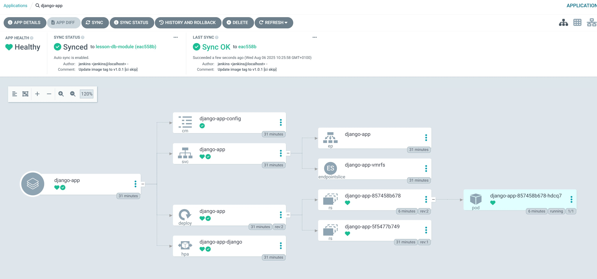

# Django Infrastructure with Terraform, Kubernetes & Helm

## Зміст

- [Опис структури проєкту](#опис-структури-проєкту)
- [Підготовка бекенду (S3 + DynamoDB) та запуск основної інфраструктури)](#підготовка-бекенду-s3--dynamodb-запуск-основної-інфраструктури)
- [Інструкція по використанню Jenkins and ArgoCD](#інструкція-по-використанню-jenkins-and-argocd)
- [Bідкриття застосунку](#відкриття-застосунку)
- [Опис CI/CD архітектури](#опис-cicd-архітектури)
- [Робота CI/CD архітектури](#робота-cicd-архітектури)
- [RDS та пояснення її інфраструктури](#rds-та-пояснення-її-інфраструктури)
- [Видалення інфраструктури](#видалення-інфраструктури)

---

## Опис структури проєкту
Основна логіка відбувається в директорії lesson-8-9

```sass
lesson-8-9/
├── terraform/                         # Основна директорія з Terraform конфігурацією
│   ├── main.tf                        # Підключення модулів (root-модуль)
│   ├── backend.tf                     # Налаштування бекенду Terraform (S3 + DynamoDB)
│   ├── outputs.tf                     # Загальні вихідні дані інфраструктури
│   └── modules/                       # Всі модулі інфраструктури
│       ├── s3-backend/               # Модуль для створення S3-бакета та DynamoDB таблиці
│       │   ├── s3.tf                 # Створення S3-бакета для Terraform state
│       │   ├── dynamodb.tf           # Створення DynamoDB для блокування Terraform
│       │   ├── variables.tf          # Змінні модуля
│       │   └── outputs.tf            # Виводи: імена ресурсів
│       │
│       ├── vpc/                      # Модуль для створення VPC
│       │   ├── vpc.tf                # Основна мережа, сабнети, Internet Gateway
│       │   ├── routes.tf             # Маршрутизація та маршрутні таблиці
│       │   ├── variables.tf          # Вхідні параметри для VPC
│       │   └── outputs.tf            # Виводи з модуля VPC
│       │
│       ├── ecr/                      # Модуль для створення ECR репозиторію
│       │   ├── ecr.tf                # Ресурс ECR
│       │   ├── variables.tf          # Змінні для ECR
│       │   └── outputs.tf            # URL репозиторію
│       │
│       ├── eks/                      # Модуль для створення Kubernetes (EKS) кластера
│       │   ├── eks.tf                # EKS кластер і worker-и
│       │   ├── aws_ebs_csi_driver.tf # Встановлення CSI драйвера для EBS
│       │   ├── variables.tf          # Змінні для кластера
│       │   └── outputs.tf            # Інформація про кластер (ім’я, endpoint, kubeconfig)
|       |
|       ├── rds/                      # Модуль для RDS
│       │   ├── rds.tf                # Створення RDS бази даних  
│       │   ├── aurora.tf             # Створення aurora кластера бази даних  
│       │   ├── shared.tf             # Спільні ресурси  
│       │   ├── variables.tf          # Змінні (ресурси, креденшели, values)
│       │   └── outputs.tf            # Інформація про RDS-endpoint
│       │
│       ├── jenkins/                  # Модуль для розгортання Jenkins через Helm
│       │   ├── jenkins.tf            # Helm release для Jenkins
│       │   ├── variables.tf          # Параметри чарта, namespace, ресурси
│       │   ├── providers.tf          # Kubernetes та Helm провайдери
│       │   ├── values.yaml           # Конфігурація Jenkins (ресурси, доступ)
│       │   └── outputs.tf            # Вивід: адреса Jenkins, токен
│       │
│       └── argo_cd/                  # Модуль для розгортання Argo CD через Helm
│           ├── argo_cd.tf            # Helm release для Argo CD (раніше jenkins.tf)
│           ├── variables.tf          # Параметри чарта Argo CD
│           ├── providers.tf          # Провайдери для Kubernetes/Helm
│           ├── values.yaml           # Конфігурація Argo CD
│           ├── outputs.tf            # Вивід: hostname, пароль адміністратора
│           └── charts/               # Helm-чарт для створення ArgoCD applications
│               ├── Chart.yaml        # Мета-інформація про чарт
│               ├── values.yaml       # Список застосунків та репозиторіїв
│               └── templates/
│                   ├── application.yaml   # Арго застосунок (App)
│                   └── repository.yaml    # Git-репозиторій для Argo CD
│
├── django_app/                     # Django застосунок з Dockerfile
│   └── Dockerfile                  # Dockerfile для створення образу застосунку
│
├── charts/                         # Helm-чарти для мікросервісів, не пов’язані з модулями
│   └── django-app/                 # Helm-чарт для Django застосунку
│       ├── Chart.yaml              # Опис чарта
│       ├── values.yaml             # Змінні середовища
│       └── templates/              # Kubernetes-ресурси
│           ├── deployment.yaml     # Деплоймент Django
│           ├── service.yaml        # Сервіс для доступу
│           ├── configmap.yaml      # Конфігурація Django
│           └── hpa.yaml            # Horizontal Pod Autoscaler
│
└── scripts/                        # Bash-скрипти для роботи з проєктом
    └── delete-all.sh               # Скрипт автоматичного видалення  S3 backend та всієї інфраструктури
    └── init-all.sh                 # Скрипт автоматичного встановлення S3 backend та всієї інфраструктури

```

---

###  Огляд інфрастуктури

Проєкт забезпечує наступне за допомогою Terraform:

- **S3 + DynamoDB** — Бекенд для стану та блокування Terraform
- **VPC** — з підмережами, маршрутизацією, доступом до Інтернету
- **EKS Cluster** — керований кластер Kubernetes
- **ECR** — реєстр контейнерів для образу Docker


### Архітектура проекту

```
[ Django Pod ]
     │
[ Kubernetes Service (LoadBalancer) ]
     │
[ AWS ELB (external DNS) ]
     │
[ Browser / curl ]
```

> Запити ззовні потрапляють на ELB, який перенаправляє на сервіс у кластері, що зв'язаний з Django-подом.


###  Підготовка для роботи

Для правильної роботи проект потребує декілька інструментів. Впевніться, що дані інструменти є встановлені

- `terraform`
- `kubectl`
- `awscli`
- `helm`
- `docker`

Для успішного запуску інфрастурктури в папці **terraform** повиннен бути файл **terraform.tfvars** з натупними змінними (можна переглянути перелік змінних в **terraform.tfvars.example**):

- github_user        — логін GitHub
- github_token       — токен для доступу до репозиторію
- github_repo_url    — URL репозиторію з кодом
- github_branch      — гілка для деплою
- rds_username       — користувач БД
- rds_database_name  — назва БД
- rds_password       — пароль до БД

---


## Підготовка бекенду (S3 + DynamoDB) та створення основної інфраструктури

Для створення:

 - S3 bucket для зберігання terraform.tfstate
 - DynamoDB таблицю для блокування
 - VPC, кластер EKS, репозиторій ECR тощо.

Радимо використовувати готовий скрипт, який не тільки розгорне інфраструктуру, а й зразу заєднається з Kubernetes та надасть посилання для Jenkins, ArgoCD та нашого застовунку django-app та встановить заязки з RDS.


```bash
cd "$(git rev-parse --show-toplevel)"
cd lesson-8-9/scripts
./init-all.sh
```

Результатом роботи цього скрипта будуть посилання на відповідні ресурси, які показані на малюнку


Крім того даний скрипт автоматично створить змінні оточення в Kubernetes для доступу до RDS.

---


## Інструкція по використанню Jenkins and ArgoCD

### Jenkins 

Перш за все потрібно дозволити роботу **seed-job** для цього переходимо за посиланням з попереднього пункту та вводимо відновідні логін та пароль. Як результат буде наступний Dashboard Jenkins


Наступним кроком буде підтвердження скрипта для виконання цієї job. Для цього потрібно перейти на **Manage Jenkins** та знайти секцію **In-process Script Approve**


Далі підтверджуємо скрипт (натискємо кнопку **Approve**) та переходимо до **My views**


Після чого переходимо до **seed-job**


та запускаємо buid нашого pipeline


і як результат через деякий час (5-10 хв) в  Dashboard Jenkins зявиться нова job **django-docker**


---

### ArgoCD

Після завершення job django-docker з Jenkins в нас в **ecr** є образ нашого застосунку.
Тому для перевірки стану застосунку потрібно перейти за посиланням яке отримуємо після заверешення встановлення інфраструктури та ввеси відновідні пароль на логін. В отриманому Dashboard вибираємо застосунок django-app і превіряємо його стан.





---

## Відкриття застосунку

Відкриття застосунку django-app повинно бути здійснено після перевірки роботи його в argoCD. Крім того, можливий випадок,коли потрібно зачекати до 10 хв, поки loadBalancer застосунку розгорнеться. Тому якшо перехід по посиланню яке отримано в кінці роботи скрипта по розгортанню інфраструктури, містить помилку підключення, спробуйте зайти на ресурс через декілька хвилин.


## Опис CI/CD архітектури
```sass
              GitHub (код і Helm chart)
                     ▲
                     │
     ┌───────────────┴───────────────┐
     │         Continuous            │
     │         Integration           │
     │           Jenkins             │
     │  (запускається через Helm)    │
     │      │                ▲       │
     │      ▼                │       │
     │  1. Збірка Docker-образу      │
     │  2. Push до Amazon ECR        │
     │  3. Зміна values.yaml         │
     │  4. Push у GitHub (main)      │
     └───────────────┬───────────────┘
                     │
                     ▼
         ┌──────────────────────────┐
         │       Continuous         │
         │        Delivery          │
         │         Argo CD          │
         │   (встановлено Helm+TF)  │
         └───────────┬──────────────┘
                     │
                     ▼
            Kubernetes кластер (EKS)

```

## Робота CI/CD архітектури

Уявімо, що ваша команда працює над Django-застосунком. Код пишеться локально, тестується, і коли він готовий — розробник пушить зміни до репозиторію на **GitHub**. Саме з цього моменту і запускається весь автоматизований процес.

Все починається з **GitHub**, який відіграє роль центрального місця зберігання не лише коду, а й конфігурацій для деплою. У репозиторії зберігаються два ключові елементи: сам код **Django** і **Helm-чарт**, який описує, як цей код буде розгорнуто у **Kubernetes**. Тобто, **Helm-чарт** — це «інструкція», за якою Kubernetes зрозуміє, що і як запускати.

Коли код потрапляє у main-гілку, у гру вступає **Jenkins** — наша система безперервної інтеграції **(CI)**. Він автоматично активується після змін у репозиторії. Але **Jenkins** не просто запускається — він розгорнутий у **Kubernetes**-кластері через **Helm**, а сама його інсталяція автоматизована **Terraform**-скриптами. Тобто **Jenkins** — повністю частина нашої інфраструктури як коду.

**Jenkins** бере нову версію коду та запускає **Jenkins pipeline** — це набір автоматизованих кроків, які виконуються послідовно. Спочатку, за допомогою **Kaniko** (інструмент для безпечної збірки **Docker**-образів без потреби в root-доступі), він створює новий **Docker**-образ **Django**-застосунку. Далі цей образ відправляється в **Amazon ECR** — приватний контейнерний реєстр у хмарі AWS, де зберігаються всі наші зібрані образи.

Але на цьому **Jenkins** не зупиняється. Щоб **Kubernetes** знав, що з’явився новий образ, **Jenkins** автоматично відкриває **Helm**-чарт, знаходить у ньому файл **values.yaml** і оновлює тег образу (наприклад, image.tag: v23 замість v22). Після цього **Jenkins** комітить і пушить цю зміну назад у репозиторій на **GitHub**. Тобто **Helm**-чарт оновлено — Git знає, що треба деплоїти нову версію.

І ось тут вмикається **Argo CD** — система безперервної доставки **(CD)**, яка також встановлена через **Helm** і **Terraform**. **Argo CD** працює за принципом **GitOps** — він не чекає ручних команд, а постійно стежить за Git-репозиторієм. Щойно він бачить, що файл values.yaml змінився — значить, вийшла нова версія застосунку. **Argo CD** автоматично запускає оновлення, не потребуючи жодної дії з боку розробника.

На цьому етапі **Kubernetes**-кластер, створений через **Terraform** в **Amazon EKS**, отримує нову конфігурацію **Helm**. **Kubernetes** оновлює відповідний **Helm**-реліз, зупиняє старі **Pod**-и, і запускає нові, вже з новим **Docker**-образом, який нещодавно зібрав **Jenkins**.

У результаті — нова версія **Django**-застосунку вже працює в кластері. Але як користувач потрапляє на сайт?

Тут усе просто. **Kubernetes** створює сервіс типу **LoadBalancer**, який автоматично підключається до зовнішнього **AWS Load Balancer (ELB)**. Цей балансувальник отримує публічний **DNS** (наприклад, my-app-123456.elb.amazonaws.com), і коли користувач відкриває цю адресу у браузері, запит проходить такий шлях:

```sass
Користувач → AWS ELB → Kubernetes Service → Django Pod
```

Запит надходить іззовні, переходить через балансувальник до сервісу **Kubernetes**, а далі вже передається безпосередньо у **Pod** із вашим **Django**-застосунком.

---

**Що відбувається після кожного оновлення**

Уся система працює як замкнене коло:

- Ви пушите нову версію коду.

- Jenkins автоматично збирає Docker-образ.

- Jenkins оновлює Helm chart і пушить зміну.

- Argo CD бачить цю зміну та деплоїть нову версію.

- Kubernetes оновлює застосунок у кластері.

- Користувач бачить результат без жодної затримки або ручного втручання.

## RDS та пояснення її інфраструктури

У цьому проєкті база даних (PostgreSQL) створюється та управляється за допомогою Terraform, а Django-застосунок розгортається в Kubernetes і отримує доступ до цієї бази через Kubernetes Secret.

Нижче наведена схема підключення застосунку до RDS PostgreSQL.

```sass
     terraform.tfvars         - значення (юзер, пароль, назва БД)
          │
          ▼
     Terraform modules/rds/   - створює RDS у AWS
          │
          ▼
     terraform output         - отримуємо адресу БД (endpoint)
          │
          ▼
     bash-скрипт + Kubernetes - створює Secret із даними
          │
          ▼
     Django/додаток у K8s     - підключається до БД

```

#### terraform.tfvars
На першому етапі змінні для бази зберігаються у terraform.tfvars
Це конфігураційний файл, де зберігаються значення змінних для Terraform. Серед них:

- **rds_username** — логін користувача бази

- **rds_password** — пароль

- **rds_database_name** — назва бази даних

> Ці змінні не зашиті в код, а винесені у файл, щоб було зручно і безпечно змінювати параметри під час розгортання.


####  Модуль terraform/modules/rds/ створює RDS в AWS

Використовуючи вхідні змінні з terraform.tfvars, Terraform-скрипти в цьому модулі:

- створюють або стандартну RDS, або Aurora кластер (залежно від умов)

- виставляють конфігурацію (назва БД, логін, пароль, порт тощо)

- створюють потрібні параметри безпеки (VPC, підмережі, SG)

> У результаті створюється ізольована база даних, яка доступна тільки з внутрішньої мережі AWS.

#### Адреса бази (endpoint) прокидується як terraform output

Після створення, Terraform отримує публічну адресу (endpoint) цієї бази через outputs.tf

> Це дозволяє звернутись до цієї адреси з інших частин проєкту, наприклад, у Bash-скриптах або Helm-чартах.

#### Bash-скрипт отримує цю адресу і створює Kubernetes Secret

Після створення інфраструктури, спеціальний Bash-скрипт:

- викликає terraform output -raw rds_endpoint щоб отримати адресу бази

- зчитує ім'я бази, логін і пароль з terraform.tfvars або .env

- створює Kubernetes Secret типу Opaque, який зберігає ці значення

> Таким чином, ми уникаємо хардкодування конфіденційної інформації в YAML чи Python.

####  Django-додаток читає ці значення з Secret

Під час запуску Django у Kubernetes:

- у Pod додається envFrom: secretRef

- Django читає змінні оточення типу POSTGRES_HOST, POSTGRES_USER, POSTGRES_PASSWORD, POSTGRES_DB

- і використовує їх у settings.py для підключення до бази даних

> Таким чином, якщо зміниться адреса або пароль БД, достатньо просто оновити Secret і перезапустити Pod.


Використання даного підходу забезпечує:

- безпеку - жодні секрети не потрапляють у Git чи CI/CD логи, 
- масштабованість —  можна створювати кілька середовищ (dev/stage/prod) з різними налаштуваннями
- гнучкість — будь-який компонент (RDS, Kubernetes, Django) можна оновити незалежно

## Видалення інфраструктури


Для видалення всіх встановлених ресурсів рекомендується з папки **scripts**

```bash
cd "$(git rev-parse --show-toplevel)"
cd lesson-8-9/scripts
```

запустити скрипт

```bash
./delete-all.sh
```

даний скрипт знищить не тільки встановлені ресурси, але й ресурси які були створені поза Terraform. І якшо їх залишити то видалення через команду **terraform destroy** може завершитись з помилкою.

> Видалення всієї інфраструктури може займати досить багато часу (від 20 до 40 хвилин).

---